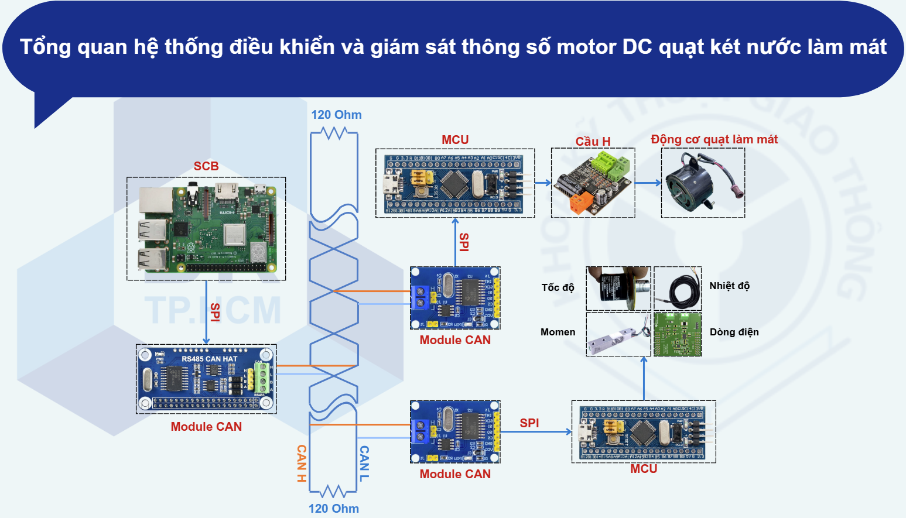

# Design and Development of a Test Bench for Diagnosing Radiator Fan DC Motors in Engine Cooling Systems

This project implements a complete test bench system for controlling and monitoring DC motors used in radiator cooling fans. It features real-time data acquisition, motor control via H-bridge, and data visualization through a Flutter-based interface running on a Raspberry Pi 3B. The system is designed to assist in diagnostics and evaluation of cooling fan motors in automotive applications.

---

## Table of Contents
- [Design and Development of a Test Bench for Diagnosing Radiator Fan DC Motors in Engine Cooling Systems](#design-and-development-of-a-test-bench-for-diagnosing-radiator-fan-dc-motors-in-engine-cooling-systems)
  - [Table of Contents](#table-of-contents)
  - [📷 System Overview](#-system-overview)
  - [📁 Project Structure](#-project-structure)
  - [🔧 Hardware Components](#-hardware-components)
  - [🧠 System Architecture](#-system-architecture)
  - [🚀 Getting Started](#-getting-started)
    - [Prerequisites](#prerequisites)
    - [Build Instructions](#build-instructions)
      - [🔹 For STM32 Firmware](#-for-stm32-firmware)
      - [🔹 For Raspberry Pi (Flutter App)](#-for-raspberry-pi-flutter-app)
  - [✅ Features](#-features)
  - [📽️ Demo](#️-demo)
  - [🛠️ Tools Used](#️-tools-used)
  - [📜 License](#-license)
  - [📚 For More Information](#-for-more-information)


---

## 📷 System Overview



---

## 📁 Project Structure

```
.
├── README.md
├── poster.jpg
├── raspi_3b                  # Raspberry Pi software
│   ├── dc_motor_tracker      # Flutter application for motor data visualization
│   │   ├── assets            # Logos and diagrams
│   │   ├── lib               # Dart source files
│   │   ├── motor_data_simulator.py  # Optional data simulator
│   │   └── pubspec.yaml      # Flutter package definitions
│   └── python
│       └── receive_from_stm32.py  # CAN data receiver via SPI
├── result
│   └── demo.mp4              # Project demonstration video
├── schematic
│   ├── schematic_diagram_base.png
│   └── schematic_diagram_overview.png
└── stm32                     # Firmware for STM32 microcontrollers
    ├── Inc                  # Header files
    └── Src                  # Source files (C)
```

---

## 🔧 Hardware Components

* **Raspberry Pi 3B** with RS485 CAN HAT
* **STM32F103C8T6 (Blue Pill)** MCUs (2x)
* **MCP2515 CAN Modules** (3x)
* **H-Bridge Module** for DC motor control
* **DC Fan Motor**
* **Sensors**:

  * Speed Sensor (e.g., LM393)
  * Torque Sensor (strain gauge)
  * Temperature Sensor (DS18B20)
  * Current Sensor (shunt-based)

---

## 🧠 System Architecture

* **Data Flow**:

  * Sensors read physical parameters (speed, torque, temperature, current).
  * STM32 MCUs acquire sensor data and transmit via CAN.
  * Raspberry Pi receives and visualizes data using a Flutter app.
  * Control signals for motor speed are sent via CAN from the Flutter UI.

* **Communication**:

  * CAN Bus with 120 Ohm termination resistors
  * SPI between STM32 ↔ MCP2515 ↔ CAN
  * SPI between Raspberry Pi ↔ RS485 CAN HAT

---

## 🚀 Getting Started

### Prerequisites

* Raspberry Pi 3B (with Raspbian or similar Linux)
* [flutter-pi](https://github.com/ardera/flutter-pi) installed on Raspberry Pi
* Dart SDK & Flutter installed for app development
* STM32CubeIDE or equivalent to build and flash STM32 firmware

### Build Instructions

#### 🔹 For STM32 Firmware

1. Open `stm32` folder and add those headers and sources in your project.
2. In this project, STM32CubeIDE is used for development.
3. Build and flash to STM32F103C8T6 boards.
4. Each STM32 node performs:

   * Sensor reading
   * Motor control via H-Bridge (one MCU)
   * CAN transmission via MCP2515

#### 🔹 For Raspberry Pi (Flutter App)

1. Navigate to `raspi_3b/dc_motor_tracker`.
2. Ensure `flutter-pi` is installed and configured.
3. Add the `assets` directory with necessary images and logos, and modify `pubspec.yaml` accordingly.
4. Add those sources in `lib` directory.
5. Also add the folder `python` with the script `receive_from_stm32.py` to handle CAN data reception.

---

## ✅ Features

* Real-time monitoring of:

  * Motor speed (RPM)
  * Torque
  * Temperature
  * Current consumption
* DC Motor speed control via UI (PWM through STM32)
* CAN Bus communication across all nodes
* Modular architecture for scalable diagnostics

---

## 📽️ Demo

Check out the demo video: 📂 [`result/demo.mp4`](./result/demo.mp4)

---

## 🛠️ Tools Used

* Language: C (STM32), Dart (Flutter), Python
* IDEs: STM32CubeIDE, Visual Studio Code
* Communication Protocol: CAN (via MCP2515)
* GUI Framework: Flutter (via `flutter-pi` on Raspberry Pi)

---

## 📜 License

This project is for educational and research purposes.
You may freely modify or extend it under an open-source or custom license of your choosing.

---

## 📚 For More Information

For further details about the system design, implementation, or usage:

* [Thiết kế băng thử tích hợp hệ thống điều khiển tốc độ thông minh cho Motor DC](https://1drv.ms/f/s!AooTAUHFQRu7hKBQZwcO3k90zWtXFQ?e=Mijl4D)
* 📄 **Project Poster**: [`poster.jpg`](poster.jpg) – Summary of the system, components, and objectives.
* 🎥 **Demo Video**: [`demo.mp4`](result/demo.mp4) – Live demonstration of the system in operation.
* 📧 **Contact**: *\[ducvietmxt@gmail.com]* – For questions, feedback, or collaboration.
